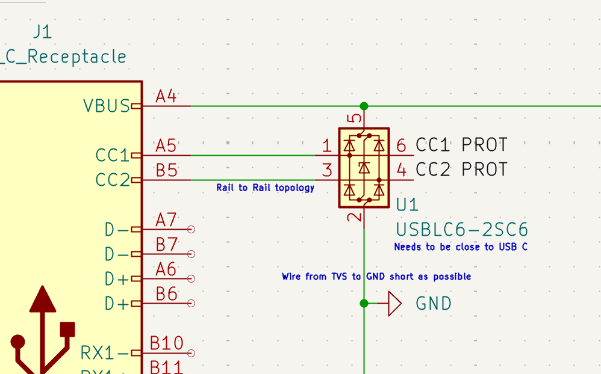
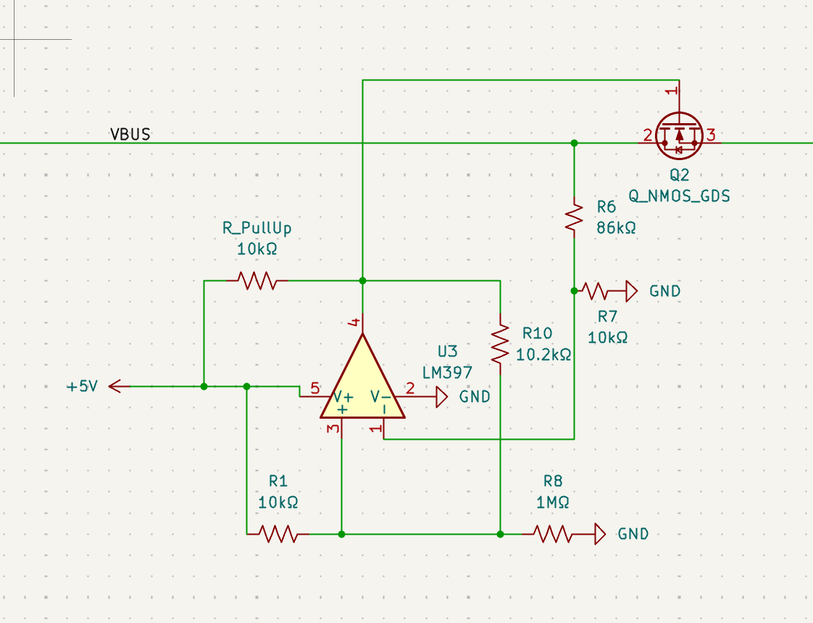
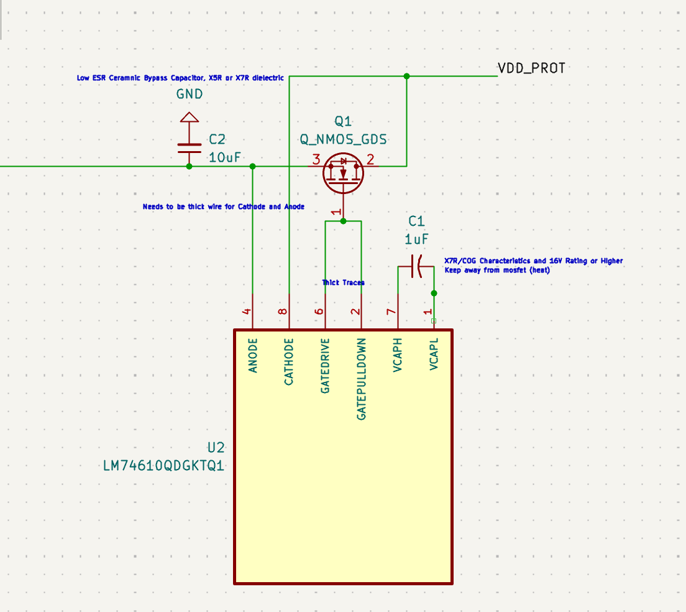
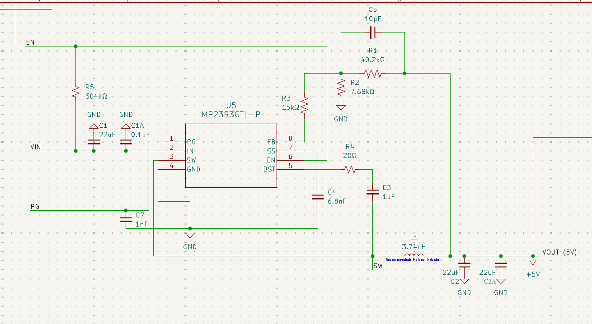
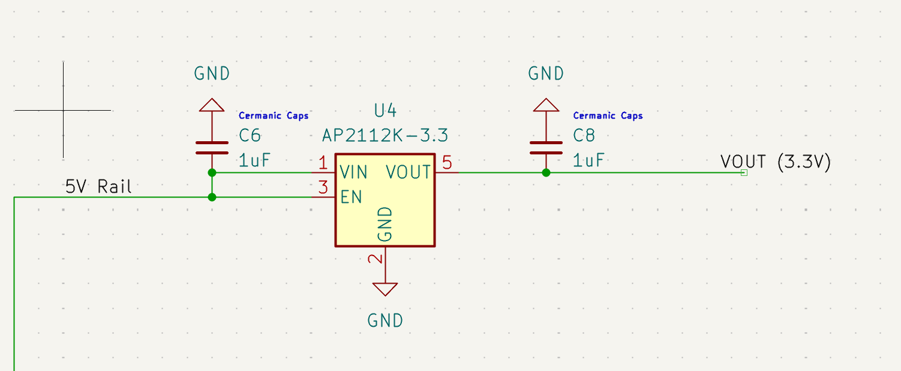
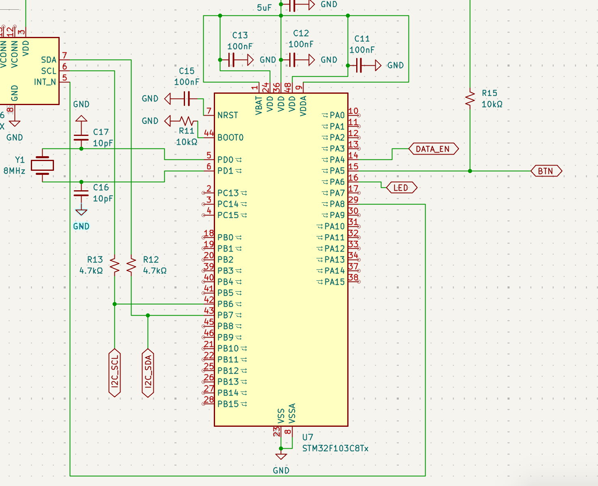
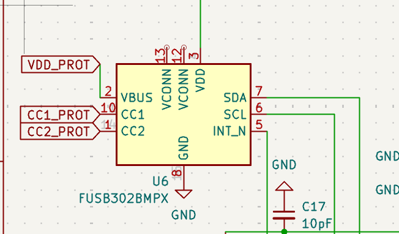
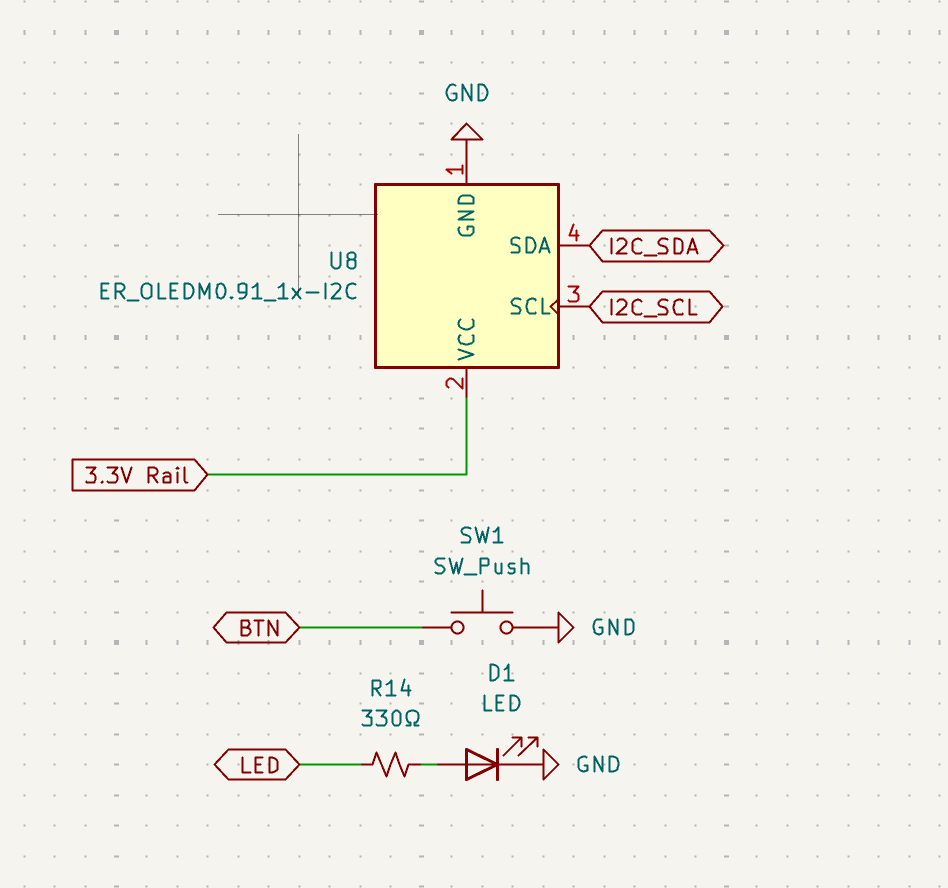
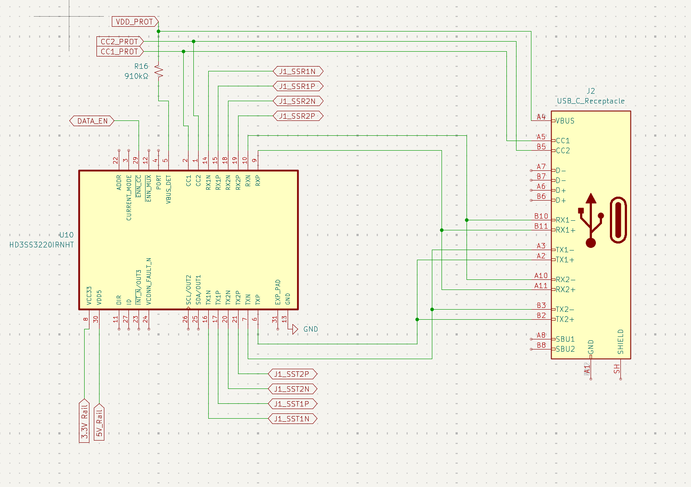

# Djarin — USB-C Security/Protection Board

## Design Documentation

### Project Overview

Djarin is a USB-C inline board that protects, monitors, and (eventually) selectively passes through power and data. It combines power-path protection (ESD, reverse-voltage, overvoltage/surge) with PD negotiation monitoring and a security-oriented data disconnect feature, split across four physical PCB faces connected by FPC jumpers.

---

## Face 1 — Power Protection

### J1 — USB-C Receptacle

- Full-pin `USB_C_Receptacle` symbol (KiCad default library)
- Only VBUS, CC1, CC2, GND, SHIELD are used on this face
- D+/D-, RX1/RX2, TX1/TX2, SBU1/SBU2 reserved for Face 4 (SuperSpeed passthrough)

### U1 — USBLC6-2SC6 (TVS array)

- STMicroelectronics ESD protection array, 2 independent channels
- Channel 1 (pins 1/6) protects CC1; Channel 2 (pins 3/4) protects CC2
- Pin 5 = VBUS, Pin 2 = GND
- **Placement rule (from datasheet):** must sit as close to J1 as physically possible — minimizes trace length for effective ESD clamping
- Physical order in the power path: **J1 → U1 (TVS) → surge protection → reverse-voltage protection → rest of board**
  - TVS goes first because it's the fastest-reacting protection (nanosecond-scale ESD events)

### Surge Detection — U3 (LM397) + Q2

**Why needed:** reverse-voltage protection (below) only blocks current flowing the wrong _direction_ — it does nothing against an overvoltage event (e.g., bad charger, USB-Killer-style attack) where current is still flowing the correct direction, just at a dangerous magnitude.

**Topology:** Inverting comparator with hysteresis (LM397 datasheet Figure 8/9)

- U3 is powered from a stable **+5V** rail (Face 2's MP2393 output) — NOT from VBUS directly, since VBUS is the signal being measured and can't also be the stable reference
- **VBUS sense divider:** R6 (86kΩ) + R7 (10kΩ) from VBUS to GND, tap feeds U3 pin 1 (VIN−)
  - At VBUS = 24V, divider output = 24 × (10k/96k) ≈ 2.5V
- **Hysteresis network (off +5V):** R1 (10kΩ) from +5V to node; R10 (1MΩ) from node to GND; R8 (10.2kΩ) from node to OUTPUT; node feeds U3 pin 3 (VIN+)
  - Calculated to trip (VT2) at ≈ 24V on VBUS, ~25mV hysteresis band (VT1 − VT2)
- **R_pullup (10kΩ):** U3 pin 4 (OUTPUT, open-collector) to +5V
- **Q2 (N-MOSFET, Q_NMOS_GDS):** cutoff switch in series with VBUS
  - Drain ← VBUS (from TVS output)
  - Source → onward to Q1 (reverse-voltage protection stage)
  - Gate ← U3 OUTPUT node
  - LM397 output is LOW when VIN > VT (per datasheet) → normal operation = output HIGH (Q2 on, power flows) → surge trips = output LOW (Q2 off, power cut). Fail-safe behavior.
- Surge stage placed **before** reverse-voltage protection stage so Q1/U2 are themselves protected from surge damage.

### Reverse-Voltage Protection — U2 (LM74610QDGKRQ1) + Q1

- "Ideal diode controller" — near-zero voltage drop vs. a passive diode, no GND pin needed (self-referenced across Anode/Cathode, functions like a diode electrically)
- Symbol/footprint imported from SnapMagic (not in KiCad default library)
- **Topology (datasheet "Smart Diode Configuration"):**
  - Anode → Q1 Source (VIN side)
  - Cathode → Q1 Drain (VOUT/protected side)
  - Gate Drive / Gate Pull Down → Q1 Gate
  - VCAPH/VCAPL → C1 (charge pump cap)
- **C1 (charge pump cap):** 1µF, X7R/COG, 16V+ rating (datasheet range: 220nF–4.7µF)
  - Keep physically away from Q1 — thermal isolation affects capacitance value
- **C2 (VIN bypass cap):** 10µF, X7R, low-ESR ceramic — wired in **parallel** (VBUS to GND), not in series
- **Q1 (N-MOSFET, Q_NMOS_GDS):** the actual reverse-blocking switch
- **Layout rules to carry into PCB stage (from datasheet Section 10):**
  - VIN-to-Source: thick trace/polygon (high current path)
  - Anode/Cathode sense traces: short as possible
  - Gate Drive/Gate Pull Down: no vias, short/thick traces, keep close to MOSFET gate

---

## Face 2 — Brain (Power Regulation + PD Negotiation)

### U4 — MP2393 (Synchronous Buck, VBUS → 5V)

- Replaces originally-considered MP2307 (marked "Not Recommended for New Designs" by MPS — refer to MP2393)
- Input range 4.2V–24V covers full VBUS range (5–20V) with margin
- 650kHz switching, up to 3A output, integrated PG (Power Good) output
- Circuit follows datasheet Figure 6 (VIN=19V, VOUT=5V/3A) almost exactly:
  - C1 (22µF) + C1A (0.1µF) input caps
  - R5 (604kΩ) EN pull-up to VIN (auto-start)
  - R4 (20Ω) + C3 (1µF) bootstrap network on BST
  - L1 (~3.3–3.74µH, sized via MPS inductor calculator at 650kHz/5V-out/2A)
  - C2 + C2A (22µF each) output caps
  - Feedback divider: R3 (15kΩ), R1 (40.2kΩ), R2 (7.68kΩ), C5 (10pF) — sets 5V output per datasheet Fig. 6
  - C7 (1nF) PG decoupling, C4 (6.8nF) soft-start timing on SS
- Output distributed via global `+5V` power symbol (used on both Face 1 and Face 2 — KiCad treats same-named power symbols as one global net, no hierarchical labels needed for power rails)

### U6 — AP2112K-3.3 (LDO, 5V → 3.3V)

- Powers STM32 + FUSB302 digital logic
- EN tied directly to VIN (always-on)
- C6 (1µF) input, C8 (1µF) output ceramic caps

### U7 — STM32F103C8Tx

LQFP48 package, chosen for native USB peripheral (needed for a planned software-triggered DFU bootloader jump — hold button 10s → firmware jumps to system bootloader, reflash over the same USB-C cable, no SWD probe required).

- **Power:** all VDD pins (1/24/36/48) + VDDA (pin 9) → +3.3V; all VSS/VSSA (23/8) → GND directly (no cap needed, GND-to-GND is a no-op)
- **Decoupling:** one 100nF ceramic per VDD/VDDA pin (C11, C12, C13), one bulk cap (C14, 5µF) on the rail
- **VBAT:** tied to +3.3V directly (no external RTC backup battery used, per ST's own AN2586 recommendation)
- **NRST:** 100nF cap (C15) to GND per ST reference reset circuit
- **BOOT0 (pin 44):** 10kΩ pull-down (R11) to GND — forces normal flash boot by default; DFU entry handled entirely in firmware (magic value in backup register + software reset + manual jump to system bootloader), not by physically toggling this pin
- **Clock (PD0/PD1):** external 8MHz crystal (Y1) + two 10pF loading caps (C16, C17) to GND — required because USB timing needs a precise external HSE clock; internal RC oscillator is not accurate enough (confirmed in ST AN2586: "CAN and USB OTG FS... can only function if an external 8MHz, 14.7456MHz or 25MHz clock (HSE) is present")
- **I2C1 (PB6=SCL, PB7=SDA):** shared bus with FUSB302 and Face 3's OLED. R12, R13 (4.7kΩ each) pull-ups to +3.3V — one set only, since it's one shared bus, not per-device
- **GPIO assignments:**
  - PA4 → `DATA_EN` (drives Face 4's HD3SS3220 ENn_CC pin — the security data on/off toggle)
  - PA5 → `BTN` (button input, external 10kΩ pull-up R15 to +3.3V, reads LOW when pressed)
  - PA6 → `LED` (status LED, through 330Ω R14)
  - PA8 → FUSB302 INT_N (interrupt input)

### U6 — FUSB302BMPX (PD negotiation reader)

- Plain address variant (0x22) — address doesn't matter since only one instance on the bus
- **VDD (pin 3)** → +3.3V (NOT VDD_PROT — this is a logic supply pin, would exceed max rating if fed raw/protected VBUS)
- **VBUS (pin 2)** → `VDD_PROT` (Face 1's protected output) — confirmed safe: datasheet states "DAC can measure VBUS up to 20V" and this pin is explicitly described as "expected to be an OVP protected input," which VDD_PROT is
- **CC1/CC2** → matched to Face 1's TVS-protected `CC1_PROT`/`CC2_PROT` nets
- **SDA/SCL/INT_N** → STM32 I2C bus + PA8
- **VCONN (pins 12/13)** → left unconnected (not supporting electronically-marked/active cables in this design)
- **GND** → GND

### SWD/bootloader decision

Chose software-triggered DFU (hold button 10s → firmware writes magic value to backup register → software reset → manual jump to system bootloader → enumerates as USB DFU device over the same cable) over a physical SWD header, for a cleaner enclosure with no exposed debug header.

**Tradeoff accepted:** no live hardware debugging (breakpoints, register inspection) during firmware bring-up — will rely on serial prints / DFU reflashing for iteration.

---

## Face 3 — Display / Control

- **U8 — SSD1306 OLED, 0.91" (128×32), I2C** (`ER_OLEDM0.91_1x-I2C`) — chosen over the more common 0.96" square module specifically for a longer/thinner form factor to match the keyfob-scale enclosure goal
  - VCC → +3.3V, GND → GND
  - SDA/SCL → shared I2C bus (global labels `I2C_SDA`/`I2C_SCL`, Bidirectional shape)
- **SW1 — tactile button**, other leg to GND, `BTN` net (external pull-up lives on Face 2, R15 10kΩ to +3.3V)
- **D1 — status LED** + **R14 (330Ω)** current-limiting resistor in series, driven by `LED` net (PA6)

---

## Face 4 — SuperSpeed Passthrough + Security Mux

### U10 — HD3SS3220IRNHT (USB Type-C DRP Port Controller w/ SuperSpeed 2:1 MUX)

**Why this part (superseded two earlier candidates):**

- TUSB542 (TI) — correct part conceptually but SnapMagic had no usable 2D/schematic symbol available
- HD3SS6126 — in KiCad's default library, but it's a generic KVM-style 2:1/1:2 differential switch with no CC-based orientation awareness; wrong tool for a flippable Type-C connector
- **HD3SS3220** — also in KiCad's default library, and is specifically designed to monitor CC1/CC2 itself, autonomously detect which physical SuperSpeed pair (RX1/TX1 or RX2/TX2) is actually live based on cable orientation, and resolve it to a single clean output pair. This is the correct tool for "one flippable USB-C connector."

**Wiring:**

- RXP/RXN/RX1P/RX1N/RX2P/RX2N/TXP/TXN/TX1.../TX2... → J1's SuperSpeed pins (both orientation pairs)
- CC1/CC2 → same `CC1_PROT`/`CC2_PROT` nets as FUSB302 (fan-out from Face 1's TVS is fine, multiple listeners on CC lines is normal)
- **VBUS_DET (pin 5)** → 910kΩ resistor (R16, nearest E24 standard to TI's specified 900kΩ) from `VDD_PROT`. No divider — single series resistor per datasheet, chip has its own internal reference.
- **PORT (pin 4)** → left unconnected (NC) → configures chip for DRP (dual-role port) mode, appropriate since this board isn't fixed as host or device
- **ADDR (pin 22)** → left unconnected (NC) → puts chip in GPIO mode rather than I2C mode (not using I2C control, ENn_CC handles the toggle)
- **ENn_CC (pin 23)** → `DATA_EN` net from STM32 PA4. Active-low: pulled low = enabled/normal operation, pulled high = fully disabled (CC logic + SS mux both shut off). This is the security data on/off toggle.
- **VDD5 (pin 30)** → +5V rail, **VCC33 (pin 8)** → +3.3V rail (chip needs both supplies)
- **DIR, VCONN_FAULT_N, INT_N/OUT3, ID** — left unconnected (optional features not used in this implementation)
- **GND/EXP_PAD** → GND

### ⚠️ OPEN ARCHITECTURAL ISSUE — not yet resolved

Two unresolved problems discovered while wiring J2 (the downstream USB-C receptacle):

1. **CC1/CC2 conflict between J1 and J2.** HD3SS3220 only resolves ONE connector's (J1's) cable-orientation ambiguity down to a single fixed SuperSpeed pair — it does not handle a second independent flippable connector. Wiring J2's CC1/CC2 directly to the same `CC1_PROT`/`CC2_PROT` nodes as J1 is WRONG: if devices are plugged into both J1 and J2 simultaneously, they would electrically fight over the same CC negotiation lines. Real docks/hubs solve this by giving the downstream port its own independent, typically fixed-role (DFP/host) CC behavior, decoupled from the upstream port's negotiation — this is architecturally closer to designing a small USB hub than a simple inline passthrough.
   - **Options to resolve (not yet decided):** (a) add a second HD3SS3220-class chip dedicated to J2's own orientation/CC resolution, feeding from U10's single resolved output on its "fixed" side, or (b) research real USB hub/dock reference designs for how downstream-port CC/role separation is normally done.
2. **J2 SuperSpeed pair is only fed from ONE of U10's resolved outputs.** Since J2 is also a flippable connector but U10 only produces a single resolved RX/TX pair (it was designed assuming a fixed-orientation "host" side, like the TI eval boards' USB Type-A connector), J2 currently only achieves SuperSpeed if plugged in one specific orientation. Documented as a known limitation pending the CC-conflict resolution above, since fixing #1 properly (second orientation-resolving chip) would likely fix this too.
3. **D+/D- (USB 2.0) has no active switch element at all.** HD3SS3220 is SuperSpeed-only — it has no D+/D- pins. Current plan: D+/D- pairs are simply shorted together at each connector (D+1↔D+2, D-1↔D-2 — standard Type-C practice per TI reference designs, since only one pair is ever live in a given cable) and pass through fixed/always-on, protected only by ESD. This means the `DATA_EN` security toggle currently only cuts SuperSpeed, not USB 2.0 fallback data — a real gap if "data off" is meant to be a complete cutoff. Would need a separate small USB2 switch IC (e.g., TS5USBA224-class part) gated by the same `DATA_EN` signal to close this gap.

**Bottom line:** Face 4's SuperSpeed input side (J1 + U10) is solid and correctly wired. The output side (J2) and full data-off coverage (D+/D-) need real design work before this face is complete — not a quick fix, a genuine architecture decision to make with time and probably some real USB hub reference designs to study.

---

## Key Component Decisions Log

| Part                   | Role                                           | Why chosen                                                                                                                                                                                                                                |
| ---------------------- | ---------------------------------------------- | ----------------------------------------------------------------------------------------------------------------------------------------------------------------------------------------------------------------------------------------- |
| USBLC6-2SC6            | CC1/CC2/VBUS ESD                               | Standard USB-C TVS array, cheap, well-documented                                                                                                                                                                                          |
| LM74610QDGKRQ1         | Reverse-voltage protection                     | Near-zero drop "ideal diode," no GND pin needed                                                                                                                                                                                           |
| LM397                  | Surge/overvoltage comparator                   | Pin-compatible with TL331, general-purpose, fast enough since TVS handles true fast transients                                                                                                                                            |
| MP2393                 | VBUS → 5V buck                                 | Active/recommended replacement for MP2307, wider input range, PG output                                                                                                                                                                   |
| AP2112K-3.3            | 5V → 3.3V LDO                                  | Simple, standard logic supply for STM32/FUSB302                                                                                                                                                                                           |
| STM32F103C8Tx          | MCU / brain                                    | Native USB peripheral (needed for DFU bootloader plan), prior hands-on experience with this family                                                                                                                                        |
| FUSB302BMPX            | PD negotiation reader                          | Standard, well-documented part, in KiCad default library                                                                                                                                                                                  |
| SSD1306 0.91" (128×32) | OLED display                                   | Longer/thinner form factor fits keyfob-scale enclosure goal better than the common 0.96" square module                                                                                                                                    |
| HD3SS3220IRNHT         | SuperSpeed 2:1 mux w/ CC orientation detection | Only candidate found that both (a) autonomously resolves Type-C cable-flip orientation via CC1/CC2 and (b) has a usable KiCad symbol in the default library — TUSB542 lacked an available schematic symbol, HD3SS6126 lacked CC-awareness |

---

## Status Summary

- **Face 1 (Protection):** complete — TVS, surge comparator + cutoff, reverse-voltage protection
- **Face 2 (Brain):** complete — MP2393 buck, AP2112K LDO, STM32F103C8Tx (power/reset/boot/clock/I2C), FUSB302
- **Face 3 (Display/Control):** complete — OLED, button, status LED
- **Face 4 (SuperSpeed passthrough):** J1-side input wiring complete and correct; **J2-side (downstream connector) has an unresolved architectural conflict — see "OPEN ARCHITECTURAL ISSUE" above.** Do not wire J2's CC1/CC2 to the same nodes as J1 until this is resolved.
- **Mechanical:** moving from folded-triangle to square-prism enclosure concept, keyfob-scale target (~35-40mm × 15-20mm per face). Not yet modeled in Fusion 360.
- **Not yet started:** PCB footprint assignment, board layout (all 4 faces as separate rigid boards + FPC jumpers), 4-layer stackup, differential pair routing for SuperSpeed lines.

---

_Document reflects design state as of the most recent working session._
